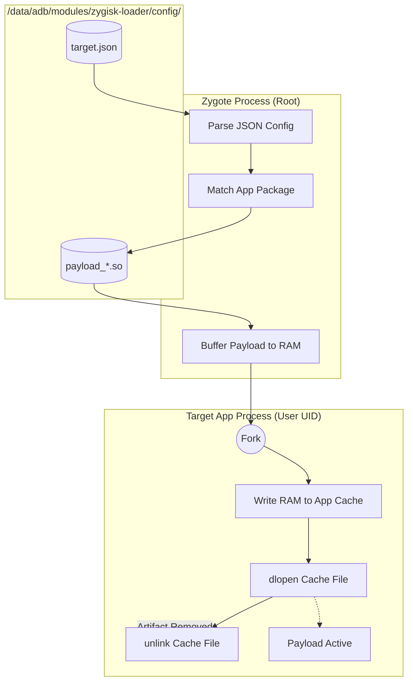

# ⚡ Zygisk-Loader


[](https://t.me/UnixPhoriaD)

**Zygisk-Loader** is a stealthy, ultra-lightweight Zygisk module written in **Pure C**. It acts as a universal bridge that dynamically injects external shared libraries (`.so`) into specific Android application processes.

Rewritten from Rust to C, this module now boasts an incredibly small footprint (**< 20KB**) with zero runtime dependencies. Unlike traditional modules that require rebuilding and rebooting, **Zygisk-Loader** enables a **"Hot-Swap" workflow**. You can recompile your instrumentation library, push it to the device, and simply restart the target app to apply changes instantly.

## Key Features

*   **Hot-Swap Capable**: Update your payload (`.so`) and deploy instantly by just restarting the target app. No device reboot required.
*   **Ultra-Lightweight**: Built with **Pure C** and standard Android NDK libraries. The module binary is microscopic (<20KB), ensuring minimal memory usage and maximum performance.
*   **Multi-App Support**: JSON-based configuration allows targeting multiple apps with different payloads simultaneously.
*   **Robust Injection**: Uses a **RAM-Buffering Strategy**. The payload is read into memory with Root privileges, then written to the app's cache in the post-specialize phase. This ensures compatibility with strict SELinux policies and isolated processes.
*   **Stealthy (Self-Deleting)**: The payload is written to disk, loaded, and **immediately unlinked**. The file vanishes from the filesystem instantly, leaving minimal traces for file scanners.
*   **Zygisk API v5**: Utilizes the latest Zygisk API for maximum compatibility with Magisk, KernelSU, and APatch.
*   **Config-Driven**: Simple JSON-based configuration. No hardcoded package names.
*   **Zero Dependencies**: Native lightweight JSON parser with no external library dependencies.

## Architecture

Zygisk-Loader separates the **Injector** (The Module) from the **Payload** (Your Logic). It bridges the permission gap between the Zygote process (Root) and the App process (Untrusted).



## Directory Structure

After installation, the module creates a configuration directory:

```text
/data/adb/modules/zygisk-loader/
├── module.prop
├── zygisk/
│   └── ...
└── config/              <-- WORKSPACE
    ├── target.json      (JSON configuration with app-package to payload mapping)
    └── payload_*.so     (Your compiled libraries for each target)
```

## Usage

### 1. Installation
1. Download the latest release `.zip`.
2. Flash via Magisk / KernelSU / APatch.
3. Reboot device.

### 2. Configuration (Multi-App Support)

Create or edit the JSON configuration file at `/data/adb/modules/zygisk-loader/config/target.json`:

```bash
# Create the config file with multiple app targets
cat > /data/adb/modules/zygisk-loader/config/target.json << 'EOF'
[
  {
    "app": "com.instagram",
    "lib": "/data/adb/modules/zygisk-loader/config/payload_ssl.so"
  },
  {
    "app": "com.facebook",
    "lib": "/data/adb/modules/zygisk-loader/config/payload_custom.so"
  },
  {
    "app": "com.threads",
    "lib": "/data/adb/modules/zygisk-loader/config/payload_research.so"
  }
]
EOF
```

**Features:**
- **Multiple Targets**: Each app can have its own dedicated payload
- **Sub-Process Coverage**: Base package name matching automatically handles processes like `com.app:remote` or `com.app:bg`
- **Flexible Formatting**: JSON parser is whitespace-tolerant

### 3. Deploy Payloads

Copy your compiled libraries to the config folder:

```bash
# Copy payload libraries for each target
cp libpayload_ssl.so /data/adb/modules/zygisk-loader/config/payload_ssl.so
cp libpayload_custom.so /data/adb/modules/zygisk-loader/config/payload_custom.so

# Set permissions (Important for Zygote to read them)
chmod 644 /data/adb/modules/zygisk-loader/config/*.so
```

### 4. Apply (Hot-Swap)

Force stop the target application. The next time it launches, the loader will inject the corresponding payload:

```bash
am force-stop com.instagram
am force-stop com.facebook
```

## Developing a Payload

Your payload does not need to know about Zygisk. It acts as a standard shared library. You can write your payload in **C, C++, or Rust**.

### Option A: Using C/C++ (Constructor Attribute)

```c
#include <android/log.h>
#include <unistd.h>

#define LOG_TAG "GhostPayload"
#define LOGI(...) __android_log_print(ANDROID_LOG_INFO, LOG_TAG, __VA_ARGS__)

// This function runs automatically when dlopen() is called
__attribute__((constructor))
void init() {
    LOGI("Hello from inside the target application!");
    LOGI("I have been loaded and my file on disk is likely already gone.");

    // Your hooking logic (e.g., Dobby, And64InlineHook) goes here
}
```

### Option B: Using Rust (ctor crate)

`Cargo.toml`:
```toml
[lib]
crate-type = ["cdylib"]

[dependencies]
ctor = "0.2"
android_logger = "0.13"
log = "0.4"
```

`src/lib.rs`:
```rust
use ctor::ctor;
use log::LevelFilter;
use android_logger::Config;

#[ctor]
fn init() {
    android_logger::init_once(
        Config::default().with_max_level(LevelFilter::Info).with_tag("GhostPayload")
    );

    // logic hooking start here
    log::info!("Hello from inside the target application!");
}
```

## Technical Constraints

*   **SELinux Compatibility**: This module uses disk injection (Write-Load-Unlink) instead of `memfd` to ensure maximum compatibility across all Android versions and SELinux contexts. `memfd` often fails on `untrusted_app` domains due to `execmem` restrictions.
*   **Isolated Processes**: The loader automatically handles isolated processes (e.g., `:remote` services) by intelligently resolving the correct data directory path.

## Disclaimer

This tool is for **educational purposes and security research only**. The author is not responsible for any misuse of this software.

## License

This project is licensed under the MIT License - see the [LICENSE](LICENSE) file for details.
